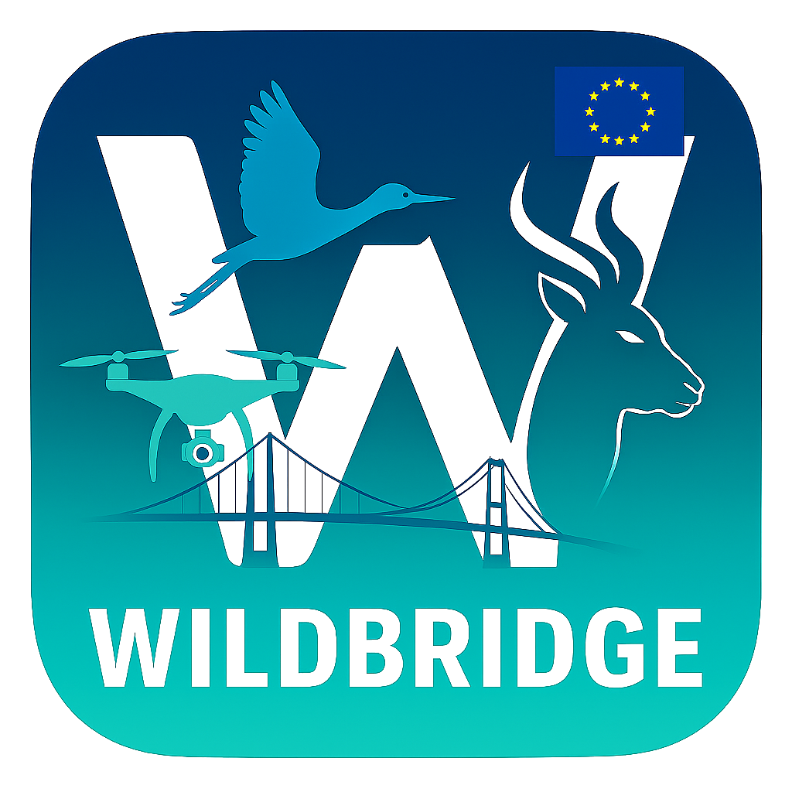

<div align="center">
  
    
  
</div>

> **WildBridge: Ground Station Interface for Lightweight Multi-Drone Control and Telemetry on DJI Platforms**  
> Part of the [WildDrone Project](https://wilddrone.eu) - European Union's Horizon Europe Research Program

## Overview

WildBridge is an open-source Android application that extends DJI's Mobile SDK V5 to provide accessible telemetry, video streaming, and low-level control for scientific research applications. Running directly on the DJI remote controller, it exposes network interfaces (HTTP and RTSP) over a local area network, enabling seamless integration with ground stations and external research tools.

 


## Research and Citation

This work is part of the WildDrone project, funded by the European Union's Horizon Europe Research Program (Grant Agreement No. 101071224).

**Academic Papers**:
```bibtex
@inproceedings{rolland2025wildbridge,
    title={WildBridge: Ground Station Interface for Lightweight Multi-Drone Control and Telemetry on DJI Platforms},
    author={Rolland, Edouard G. A. and Meier, Kilian and Bronz, Murat and Shrikhande, Aditya M. and Richardson, Tom and Lundquist, Ulrik P. S. and Christensen, Anders L.},
    year={2025},
    note={Submitted for publication}
}
```

### Key Features

- **Real-time Telemetry**: HTTP-based access to flight data, sensor readings, and drone status
- **Live Video Streaming**: RTSP video feed compatible with OpenCV, FFmpeg, and VLC
- **Multi-drone Coordination**: Support for up to 10 concurrent drones with sub-100ms latency
- **Wildlife Monitoring**: Integrated YOLO-based object detection and geolocation
- **Scientific Applications**: Proven in conservation, wildfire detection, and atmospheric research
- **Cross-platform Integration**: Compatible with Python, ROS 2, and standard HTTP clients

## Supported Hardware

### DJI Drones (Mobile SDK V5 Compatible)
- **DJI Mini 3/Mini 3 Pro** - Consumer-grade platforms
- **DJI Mini 4 Pro** - Enhanced imaging capabilities
- **DJI Mavic 3 Enterprise Series** - Professional applications with thermal imaging
- **DJI Matrice 30 Series (M30/M30T)** - Industrial platforms
- **DJI Matrice 300 RTK** - High-precision surveying
- **DJI Matrice 350 RTK** - Latest enterprise platform

### Remote Controllers
- **DJI RC Pro** - Primary supported controller
- **DJI RC Plus** - Enterprise compatibility
- **DJI RC-N3** - Standard controller (tested with smartphones)

### System Requirements

#### Ground Station
- **OS**: Ubuntu 24.04+ / Windows 10+ / macOS 12+
- **Python**: 3.8 or higher
- **Network**: Wi-Fi 5 (802.11ac) or better
- **Hardware**: Intel Tiger Lake CPU or equivalent

#### Android App
- **Android**: 7.0 (API level 24) or higher
- **Development**: Android Studio Koala 2024.1.1
- **RAM**: 4GB minimum, 8GB recommended
- **Storage**: 2GB available space

## Performance Characteristics

Based on controlled experiments with consumer-grade hardware:

### Telemetry Performance
- **Latency**: <113ms mean, <290ms 90th percentile (up to 10 drones at 32Hz)
- **Scalability**: Optimal performance with up to 7 concurrent drones
- **Payload**: ~500 bytes per `/aircraft/allStates` request

### Video Streaming Performance
- **Latency**: 1.4-1.6s (1-4 drones), 1.8-1.9s (5-6 drones)
- **Scalability Limit**: 6 concurrent video streams before degradation
- **Format**: Standard Definition via RTSP
- **Compatibility**: FFmpeg, OpenCV, VLC

## Quick Start

### Prerequisites

1. **Hardware Setup**
   - DJI drone and compatible remote controller
   - Local Wi-Fi network (5GHz recommended)
   - Ground station computer

2. **Software Installation**
   ```bash
   git clone https://github.com/WildDrone/WildBridge.git
   cd WildBridge
   ```

3. **Python Dependencies**
   ```bash
   cd GroundStation
   pip install ultralytics opencv-python matplotlib requests nicegui numpy pillow
   ```

### Basic Usage

#### 1. Remote Controller Setup
- Connect RC to local Wi-Fi network
- Note the RC's IP address from network settings
- Install and launch WildBridge app
- Enable "Virtual Stick" mode

#### 2. Ground Station Connection

**Telemetry Access** (Python):
```python
import requests

rc_ip = "192.168.1.100"  # Your RC IP
response = requests.get(f"http://{rc_ip}:8080/aircraft/allStates")
print(response.json())
```

**Video Streaming** (OpenCV):
```python
import cv2

rtsp_url = f"rtsp://aaa:aaa@{rc_ip}:8554/streaming/live/1"
cap = cv2.VideoCapture(rtsp_url)
ret, frame = cap.read()
```

**Control Commands**:
```python
# Takeoff
requests.post(f"http://{rc_ip}:8080/send/takeoff")

# Navigate to waypoint
data = "49.306254,4.593728,20"  # lat,lon,alt
requests.post(f"http://{rc_ip}:8080/send/gotoWP", data=data)
```

## API Reference

### Telemetry Endpoints (HTTP GET)

| Endpoint | Description |
|----------|-------------|
| `/aircraft/location` | GPS coordinates and altitude |
| `/aircraft/attitude` | Pitch, roll, yaw values |
| `/aircraft/speed` | Current velocity |
| `/aircraft/heading` | Current heading |
| `/aircraft/allStates` | Complete telemetry package |
| `/aircraft/battery` | Battery level and status |

### Control Endpoints (HTTP POST)

| Endpoint | Description | Parameters |
|----------|-------------|------------|
| `/send/takeoff` | Initiate takeoff | None |
| `/send/land` | Initiate landing | None |
| `/send/RTH` | Return to home | None |
| `/send/gotoWP` | Navigate to waypoint | `lat,lon,alt` |
| `/send/gotoYaw` | Rotate to heading | `yaw_angle` |
| `/send/stick` | Virtual stick input | `pitch,roll,yaw,throttle` |
| `/send/camera/zoom` | Camera zoom control | `zoom_ratio` |
| `/send/gimbal/pitch` | Gimbal pitch control | `pitch_angle` |

### Video Streaming
- **RTSP URL**: `rtsp://aaa:aaa@{RC_IP}:8554/streaming/live/1`
- **Format**: H.264, Standard Definition
- **Latency**: 1.4-1.9 seconds (depending on network)

## Project Structure

```
WildBridge/
├── GroundStation/                  # Python ground control system
│   ├── djiInterface.py            # Full DJI communication API
│   ├── djiInterfaceLite.py        # Lightweight interface
│   ├── mainLive.py               # Live mission control
│   ├── objectDetection.py        # YOLO-based detection
│   ├── objectPosition.py         # 3D position estimation
│   ├── dataLogger.py             # Flight data logging
│   └── utils/                    # Utility scripts
├── SampleCode-V5/                 # Android application
│   ├── android-sdk-v5-as/        # Main app project
│   ├── android-sdk-v5-sample/    # Sample implementations
│   └── android-sdk-v5-uxsdk/     # UI components
├── localisation_data/            # Research datasets
source
```

## Development Guide

### Android App Development

#### Step-by-Step Setup

1. **Enable Developer Mode and USB Debugging on your Android Device**
   - Put your Android device in developer mode (search "enable developer mode Android" for instructions).
   - Enable USB debugging in developer options.

2. **Install Android Studio**
   - Download and install Android Studio Koala 2024.1.1:
     [Download Android Studio Koala 2024.1.1](https://redirector.gvt1.com/edgedl/android/studio/ide-zips/2024.1.2.13/android-studio-2024.1.2.13-linux.tar.gz)

3. **Clone the WildBridge Repository**
   - Open a terminal and run:
     ```bash
     git clone https://github.com/WildDrone/WildBridge.git
     ```

4. **Open the Project in Android Studio**
   - In Android Studio, select "Open" and choose:
     ```
     /workspace/WildBridge/SampleCode-V5/android-sdk-v5-as
     ```

5. **Build and Deploy the App**
   - Build the app in Android Studio. Install any prompted dependencies.
   - Deploy the app to your controller.

6. **Start the HTTP Server on the Drone Controller**
   - In WildBridge, click "Testing Tools".
   - Open the "Virtual Stick" page.
   - The HTTP server is now running. You can send commands, view RTSP videofeed, and retrieve telemetry.

Refer to the code snippets in the Quick Start section for examples of sending commands and retrieving telemetry.

### Ground Station Development

**Core APIs**:
```python
from GroundStation.djiInterfaceLite import DJIInterfaceLite

# Initialize connection
dji = DJIInterfaceLite("192.168.1.100")

# Mission execution
dji.requestSendTakeOff()
waypoints = [(lat1, lon1, alt1), (lat2, lon2, alt2)]
dji.requestSendNavigateTrajectory(waypoints, final_yaw)
```

**Adding Custom Detection**:
```python
from GroundStation.objectDetection import ObjectDetectionWorld

detector = ObjectDetectionWorld(
    droneInterface, 
    classes=["elephant", "rhino", "bird"]
)
```

### ROS 2 Integration

WildBridge includes a complete ROS 2 implementation developed using **ROS Humble**, demonstrating how WildBridge HTTP requests can be seamlessly integrated into robotics applications.

#### Features
- **Multi-drone Support**: Simultaneous control of multiple DJI drones
- **Real-time Telemetry**: Publishing drone states as ROS topics
- **RTSP Video Streaming**: Live video feed integration with ROS Image messages
- **Command Interface**: ROS service calls for drone control
- **Dynamic Discovery**: Automatic drone detection via MAC address lookup

#### Package Structure
```
GroundStation/ROS/
├── dji_controller/          # Main drone control package
│   ├── controller.py        # ROS node for drone commands and telemetry
│   └── dji_interface.py     # HTTP interface wrapper
├── drone_videofeed/         # RTSP video streaming package
│   └── rtsp.py             # Video feed ROS node
└── wildview_bringup/        # Launch configuration
    └── swarm_connection.launch.py  # Multi-drone launch file
```

#### ROS Topics

**Published Topics** (per drone):
- `/drone_N/speed` - Current velocity magnitude
- `/drone_N/location` - GPS coordinates (NavSatFix)
- `/drone_N/attitude` - Pitch, roll, yaw
- `/drone_N/battery_level` - Battery percentage
- `/drone_N/video_frames` - Live camera feed (Image)

**Subscribed Topics** (commands):
- `/drone_N/command/takeoff` - Takeoff command
- `/drone_N/command/goto_waypoint` - Navigate to coordinates
- `/drone_N/command/gimbal_pitch` - Gimbal control

#### Usage Example
```bash
# Launch multi-drone system
ros2 launch wildview_bringup swarm_connection.launch.py

# Send takeoff command
ros2 topic pub /drone_1/command/takeoff std_msgs/Empty

# Navigate to waypoint [lat, lon, alt, yaw]
ros2 topic pub /drone_1/command/goto_waypoint std_msgs/Float64MultiArray "{data: [49.306254, 4.593728, 20.0, 90.0]}"

# Monitor telemetry
ros2 topic echo /drone_1/location
```

This ROS2 implementation showcases how WildBridge's HTTP API can be wrapped for integration with existing robotics frameworks, enabling seamless multi-drone coordination in research applications.

## Scientific Applications

WildBridge has been validated in multiple research domains:

- **Wildlife Conservation**: Real-time animal detection and geolocation
- **Wildfire Detection**: Early fire detection and mapping
- **Atmospheric Research**: Wind field profiling and measurement
- **Multi-drone Coordination**: Swarm-based data collection
- **Conservation Monitoring**: Long-term ecosystem studies

## Limitations and Considerations

### Technical Limitations
- **Video Scalability**: Maximum 6 concurrent video streams
- **Telemetry Rate**: Optimal performance up to 32Hz request rate
- **Synchronization**: Video and telemetry streams are not synchronized
- **SDK Dependency**: Relies on DJI Mobile SDK V5 evolution

### Operational Considerations
- **Setup Time**: Multi-drone configurations require network setup
- **Environmental Factors**: Performance affected by Wi-Fi interference
- **Data Synchronization**: Post-mission data alignment requires planning

## Troubleshooting

### Common Issues

**Connection Problems**:
- Verify RC IP address in network settings
- Check Wi-Fi network compatibility (5GHz preferred)
- Ensure WildBridge app is running and Virtual Stick enabled

**Video Stream Issues**:
- Test RTSP URL in VLC: `rtsp://aaa:aaa@{RC_IP}:8554/streaming/live/1`
- Check network bandwidth for multiple streams
- Verify firewall settings on ground station


**Waypoint Navigation Issues**:
- If you send a drone to a waypoint but it does not move, ensure that Virtual Stick is enabled. You can enable Virtual Stick in the DJI App or send a command to enable it. Once enabled, the drone should be able to move to the waypoint.

### Debug Commands
```bash
# Test connectivity
ping {RC_IP}

# Test video stream
ffplay rtsp://aaa:aaa@{RC_IP}:8554/streaming/live/1

# Monitor telemetry
curl http://{RC_IP}:8080/aircraft/allStates
```

## License

This project is licensed under the MIT License - see the [LICENSE.txt](LICENSE.txt) file for details.

## Contributing

Contributions are welcome! Please see our guidelines:

1. **Bug Reports**: Use GitHub issues with reproduction steps
2. **Feature Requests**: Describe use case and scientific application
3. **Code Standards**: Follow PEP 8 (Python) and Kotlin conventions
4. **Testing**: Include unit tests for new features
5. **Documentation**: Update README and code comments

For questions or collaboration inquiries, please contact the WildDrone consortium at [https://wilddrone.eu](https://wilddrone.eu).
